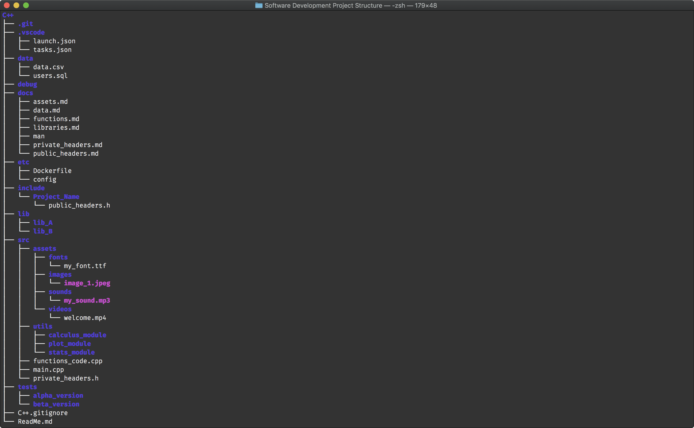

# Software Development Project Structure


------

## Introduction

Programmers 👨🏻‍💻 had different practices on how they decide to structure their code🗄📂📚📝. This repository has the purpose of creating a hierarchical tree file organization system standard for small to medium size projects. Each folder sorted by the programming language will contain a file structure template that can be cloned or downloaded to start new projects.

After some research, I have come to a project structure that shall avoid confusion being as simple as possible and should keep your code clean, neat, structured, and clutter free. The file structure system is modular and suited to modern standards, therefore you can add or remove files and folders to tailor it to a particular project or task. Each folder has its own explanation in this guide and more documentation in the folder itself.

## File System Characteristics

The most elemental file structure is made of several components to place the source code, private and public headers, asstets (images, fonts, sounds, etc.), libraries, debugging files, test files, a .gitignore file, and a documentation file. The Integrated Development Enviroment (IDE) can add extra configuration files. A simple structure for a C++ project named Project_Name would have a similar layout to this tree:

```
Project_Name/
├── debug/
├── include/
│   ├── Project_Name/
│   │   └── public_headers.h
├── lib/
│   └── lib_A/
├── src/
│   ├── assets/
│   │   └── image_A.jpeg
│   │   └── font_A.ttf
│   ├── main.cpp
│   └── private_headers.h
├── tests/
│   └── alpha_version/
├── C++.gitignore
└── ReadMe.md
```

Let's break the structure down to understand its hierarchy.

### 1. *Project_Name/*

The *Project_Name/* is the project parent directory where all the related files are located from source to binaries. The name of the folder should be Project_Name. The folder would contain the source code, libraries, assets, debugging, testing, and release files. Also, the folder in *Project_Name/include/* should be named the same as the *Project_Name/*.

### 2. *Project_Name/debug/*

The *Project_Name/debug/* directory includes the compile, debugging, run, and binaries files of the program. Is the test directory for change in the program and where all the cache files are placed on compiled, debugged, and runned. The folder tree for a debugging session with VS Code and Clang++ would look like 

```
Project_Name/
├── debug/
│   ├── main.dSYM/
│   │   ├── Contents/
│   │   │   ├── Resources/
│   │   │   │   ├── DWARF/
│   │   │   │   │   ├── main
│   │   │   └── Info.plist
│   └── main
```

### 3. *Project_Name/include/*

By convention, the *Project_Name/include/* directory is for header files, but modern practice suggests that include directory must strictly contain headers that need to be **exposed publicly**. An interesting thing to note here is the use of another directory inside the *Project_Name/include/* directory with the name same as that of your project. The reason to do this is to give a sense of specification when someone tries to use your library and public headers. Therefore, instead of using a generalized 

``` #include <public_header.h>
#include <public_header.h>
```

we need to specify that the header file that we are includding is exposed publicly on the project giving a more intuitive and clean code as

``` #include <Project_Name/public_headers.h>
#include <Project_Name/public_headers.h>
```

The header file in the *Project_Name/include/Project_Name/* directory will be exposing those functions and classed that can be publicly called and used by someone using your library. The folder tree would look like

```
Project_Name/
├── include/
│   ├── Project_Name/
│   │   └── public_headers.h
```

### 4. *Project_Name/lib/*

The *Project_Name/lib/* directory consists all the **third party libraries** that are needed by your project. Usually if you look into any of the third party libraries present here, they would be following a similar structure that you are using for your project. A point to note is there are two ways of using third party libraries in C++ — **static** and **dynamic**. This lib directory is only for static ones. The folder tree would look like

```
Project_Name/
├── lib/
│   ├── lib_A/
│   └── lib_B/
```

### 5. *Project_Name/src/*

The *Project_Name/src/* directory contains all the **source code** and the **header files** that are private and for internal use only. All the code that your project consists of must go in here. Other directories have the cmoponents needed to run, debug, and release the program but the src directory has the program itself. The folder may have subdirectories to separate functions, components, and other files. The folder tree would look like

```
Project_Name/
├── src/
│   ├── assets/
│   │   ├── images/
│   │   │   └── image_A.jpeg
│   │   ├── fonts/
│   │   │   └── font_A.ttf
│   │   ├── sounds/
│   │   │   └── sound_A.mp4a
│   │   ├── video/
│   │   │   └── video_A.mp4
│   ├── utils/
│   ├── modules
│   ├── main.cpp
│   └── private_headers.h
```

#### a) *Project_Name/src/assets/*

The *Project_Name/src/assets* contains all the media files needed by your project. The folder must contain subfolders clasifying the files by the media type, i.e. images, fonts, sounds, etc. The folder tree would look like

```
Project_Name/
├── src/
│   ├── assets/
│   │   ├── images/
│   │   │   └── image_A.jpeg
│   │   ├── fonts/
│   │   │   └── font_A.ttf
│   │   ├── sounds/
│   │   │   └── sound_A.mp4a
│   │   ├── video/
│   │   │   └── video_A.mp4
```

#### b) *Project_Name/src/utils/*

The *Project_Name/src/utils/* directory contains code snippets and functions needed throughout the source code. They are like small functions to build bigger and more complicated code. Sometimes it is also called modules. The folder tree would look like

```
Project_Name/
├── src/
│   ├── utils/
│   │   │   ├── average.cpp
│   │   │   ├── average.h
│   │   │   ├── standard_deviation.cpp
│   │   │   ├── standard_deviation.h
│   │   │   ├── graph.cpp
│   │   │   └── graph.h
```

###	6. *Project_Name/tests/*

As the name suggests, code for unit testing is kept in this directory. Different versions of the programs such as alpha or beta developer versions are stored and tested in this directory. The files in this directory should be pre release, not finished code. When the code revision is finished it can be moved to a release directory with a version number. The folder tree would look like

```
Project_Name/
├── tests/
│   ├── alpha_version/
│   └── beta_version/
```

## Documentation

Each project should have a ReadMe.md file or equivalent in its parent directory *Project_Name/*. This file would explain the functionality of the project, overview, installation, and usage. If the project is big a table of contents is recommended. The ReadMe.md file at the parent directory is like the user initial guide, but for further documentation you should place more details about the design and technical functionality on the *Project_Name/docs/* directory. This documentation can include a full user manual, a document describing the different functions, a list of the third party libraries and assets, an explanation of the data files, and the testing results. The *Project_Name/etc/* directory includes configuration files for the project. The *Project_Name/data/* directory includes the data files for the project such as databases, cdv files, and others. The .vscode contains the configurations files for the VS Code IDE. 

## Hierarchical Files Structures Trees for VS Code

### C++ File Structure Tree

```
Project_Name/
├── .git/
├── .vscode/
│   ├── launch.json
│   └── tasks.json
├── data/
├── debug/
├── docs/
├── etc/
├── include/
│   └── Project_Name/
│       └── public_headers.h
├── lib/
├── src/
│   ├── assets/
│   │   ├── fonts/
│   │   ├── images/
│   │   ├── sounds/
│   │   └── videos/
│   ├── utils/
│   ├── functions_code.cpp
│   ├── main.cpp
│   └── private_headers.h
├── tests/
│   ├── alpha_version/
│   └── beta_version/
├── C++.gitignore
└── ReadMe.md
```

### Python File Structure Tree

```
Project_Name/
├── .git/
├── .vscode/
├── data/
├── debug/
├── docs/
├── etc/
├── include/
│   └── Project_Name/
│       └── public_functions.py
├── lib/
├── src/
│   ├── assets/
│   │   ├── fonts/
│   │   ├── images/
│   │   ├── sounds/
│   │   └── videos/
│   ├── utils/
│   ├── functions_code.py
│   ├── main.py
│   └── private_funtions.py
├── tests/
│   ├── alpha_version/
│   └── beta_version/
├── Python.gitignore
└── ReadMe.md
```

## Contributing

This is an open source library, all contributions are welcome following the next guidelines

- Each new file tree should be in its own programming language directory and following the standards explain in this document, any improvement to this methodology can be proposed in the same Pull Request as an *Enhancement.md* file (optional).
- In a *Changelog.md* file include details of the changes and improvements.

## References

[C++ application development ( Part 1 — Project structure )](ttps://medium.com/heuristics/c-application-development-part-1-project-structure-454b00f9eddc)

